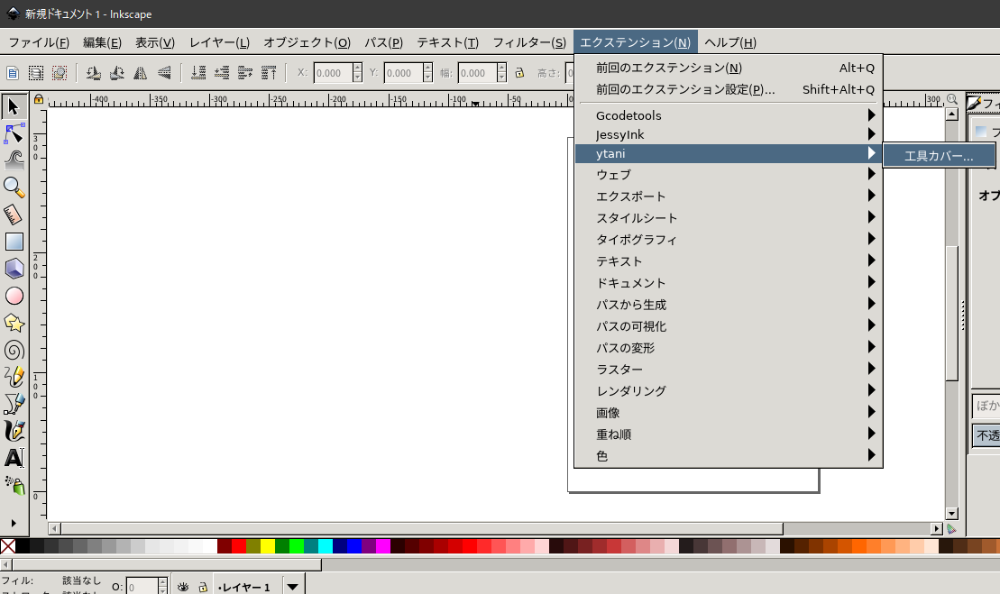
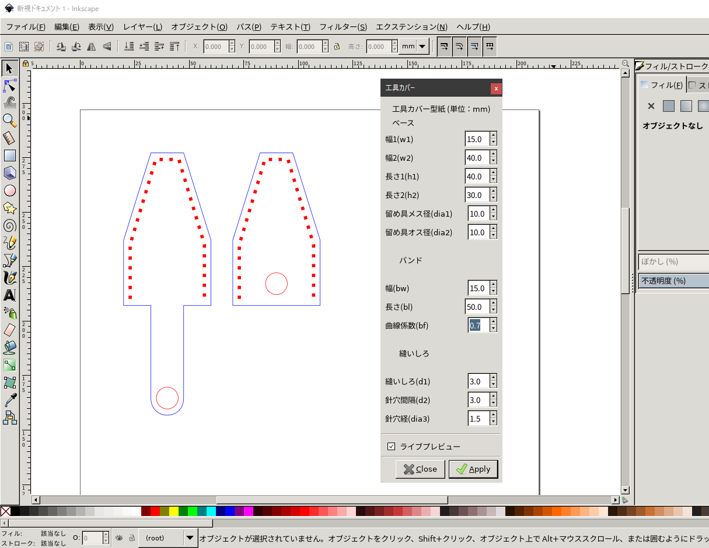

# Inkscape extension: 工具カバー型紙自動作成

## 概要

ラジオペンチやニッパーなどの工具のカバーの型紙を自動作成する
Inkscape用のエクステンション(拡張機能)です。

各部のサイズを入力すると、レーザーカッター用の型紙を自動作成します。
ライブビュー機能を利用すると、画面上で形を確認しながらサイズ調整できます。

## 1. インストール

### 1.1 Linux

```
$ cd
$ git clone ...
$ cd PlierCover
$ ./setup-linux.sh
```


### 1.2 Mac

linuxと同じ？？


### 1.3 Windows

以下の２つのファイルを所定のフォルダにコピーする。
(管理権限が必要)

コピーするファイル
* plier_cover.inx
* plier_cover.py

コピー先フォルダ
```
C:\Program Files\Inkscape\share\extensions
```


## 2. 使い方

* メニューから以下を選択

[拡張(extensions, エクステンション)]-[ytani]-[工具カバー] 



* ダイヤログにサイズを入力



* ``[ライブビュー]`` をチェックすると、画面で確認しながらサイズを調整できます。

* ``[Apply(適用)]`` をクリックすると、確定されて、キャンパスに描画されます。
(ダイヤログは自動的に閉じません。)


### 2.1 注意・コツなど

* ``[Apply(適用)]`` を何度もクリックすると、クリックした回数重ね描きされます。

* ダイアログが表示されている状態では、画面の拡大縮小などの操作ができません。
画面が小さくて見づらい場合は、一旦ダイアログを閉じて、
``[Ctrl]+[マウススクロール]`` で画面の大きさを調整してから、
やり直して下さい。


## A. Memo

### A.1 SVG パスのコマンド

```
(大文字: 絶対座標、小文字: 相対座標)

M: moveto (始点座標)
L: lineto
  H: 水平
  V: 垂直
C: curveto: "{C|c} c1x,c1y c2x,c2y x,y"
  (c1x, c1y), (c2x, c2y): 制御点
  x,y: 終点

  * 正円(半円)の場合、制御点までの距離は、直径の約0,75倍(?)
Z: closepath
```

```
ex: d="M 50,60 H 60 l 20,50 Z"
```


### A.2 Inkscape extension 描画

#### 基本書式

```python
import inkex
import simplestyle

inkex.localize()

class Foo(inkex.Effect):
    def __init__(self):
	    inkex.Effect.__init__(self)
		self.OptionParser.add_option("--opt", action="store", type="float",dest="opt", help="...")
		

    def effect(self):
	    :
		
```

現在のレイヤーに、``object``を描画。

* ``style``: 線のスタイル、
* ``attribute``: 座標、サイズ
* ``inkex.addNS()``: 図形の種類(長方形、円、パスなど)と形式(SVGなど)


ex.1
```
parent = self.current_layer
style = { ... }
attribute = { ... }
object = inkex.etree.SubElement(parent,
	                            inkex.addNS('rect', 'svg'),
								attribute)
```

#### style: 線のスタイル
ex.1
```
style = {
  'stroke': '#000000',
  'stroke-width': '0.2',
  'fill': 'none'
}
```


#### attributes: 座標、サイズ

ex.1: rect
```
attribs_rect = {
  'style': simplestyle.formatStyle(style),
  'width': '30',
  'height': '20',
  'x': '100',
  'y': '200'
}
```

ex.2: circle
```
attribs_circle = {
  'style': simplestyle.formatStyle(style),
  'r': '100',
  'cx': '150',
  'cy': '200'
}
```

ex.3: path
```
attribs_path = {
  'style': simplestyle.formatStyle(style),
  'd': 'M 50,60 H 60 l 20,50 Z'
}
```
